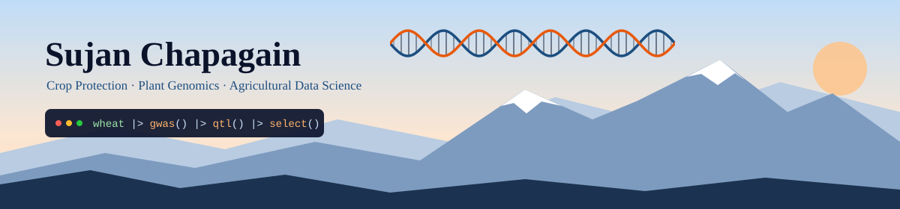

&nbsp;<a href="https://www.linkedin.com/in/sujan-chapagain-240617140/"><b>LinkedIn</b></a>
&nbsp;&nbsp;&nbsp;│&nbsp;&nbsp;&nbsp;
&nbsp;<a href="https://github.com/sujan4445"><b>GitHub</b></a>
&nbsp;&nbsp;&nbsp;│&nbsp;&nbsp;&nbsp;
&nbsp;<a href="mailto:chapagainsujan45@gmail.com"><b>Email</b></a>

## About Me

My research and coding lie at the intersection of crop protection, plant breeding, plant genomics, and sustainable agriculture. I combine hands-on field and greenhouse experimentation with statistical genetics and reproducible computational workflows in R and Python, connecting observations from the field to statistical evidence and translating complex results into clear, interpretable insights.

<table>
  <tr>
    <td width="33%" valign="top" align="center">
      
      <h3>Research</h3>
      Plant pathology, crop protection, molecular diagnostics and disease epidemiology.
    </td>
    <td width="33%" valign="top" align="center">
      
      <h3>Genomics &amp; Data</h3>
      Mixed-effects models (REML/BLUP), GWAS, QTL mapping, genomic selection, PCA, clustering and MGIDI.
    </td>
    <td width="33%" valign="top" align="center">
      
      <h3>Community</h3>
      Open science advocate sharing analytical frameworks and R workflows with students and researchers.
    </td>
  </tr>
</table>

## Toolbox

<table>
  <tr>
    <td align="center" width="140"> <b>R</b></td>
    <td align="center" width="140"> <b>RStudio</b></td>
    <td align="center" width="140"> <b>Python</b></td>
    <td align="center" width="140"> <b>Git</b></td>
    <td align="center" width="140"> <b>GitHub</b></td>
  </tr>
</table>

## Technical Competencies

<table>
  <tr>
    <td width="33%" valign="top">
      <h4>Statistical &amp; Genomic Modeling</h4>
      Univariate and multivariate statistics, linear mixed models (REML/BLUP), principal component analysis, factor analysis, hierarchical clustering, MGIDI index selection, GWAS, QTL mapping and genomic selection.
    </td>
    <td width="33%" valign="top">
      <h4>Experimental Research</h4>
      Designing and conducting controlled field and greenhouse experiments on plant protection, disease progression and sustainable crop production.
    </td>
    <td width="33%" valign="top">
      <h4>Open Science</h4>
      Building automated data pipelines and sharing open-source R code with the agricultural research community.
    </td>
  </tr>
</table>
