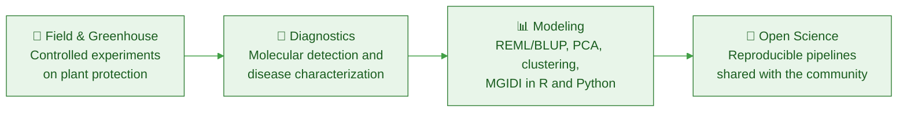

<!-- =============================== HEADER =============================== -->

  

&nbsp;<a href="https://www.linkedin.com/in/sujan-chapagain-240617140/"><b>LinkedIn</b></a>
&nbsp;&nbsp;&nbsp;│&nbsp;&nbsp;&nbsp;
&nbsp;<a href="https://github.com/sujan4445"><b>GitHub</b></a>
&nbsp;&nbsp;&nbsp;│&nbsp;&nbsp;&nbsp;
&nbsp;<a href="mailto:chapagainsujan45@gmail.com"><b>Email</b></a>

## 🌿 About Me

I am a researcher working at the intersection of **crop protection**, **plant health** and **sustainable agriculture**. My work centers on **molecular diagnostics** and **disease management**, with a particular focus on **citrus research**.

I pair hands-on field and greenhouse experimentation with statistical modeling and reproducible computational pipelines in **R** and **Python**, so that every result can be traced from the plot to the p-value.

<table>
  <tr>
    <td width="33%" valign="top" align="center">
      
      <h3>Research</h3>
      Plant pathology, crop protection, molecular diagnostics and disease epidemiology.
    </td>
    <td width="33%" valign="top" align="center">
      
      <h3>Data Science</h3>
      Mixed-effects models (REML/BLUP), PCA, clustering and multi-trait selection indices (MGIDI).
    </td>
    <td width="33%" valign="top" align="center">
      
      <h3>Community</h3>
      Open science advocate sharing analytical frameworks and R workflows with students and researchers.
    </td>
  </tr>
</table>

## 🔄 How I Work

## 🧪 Fields of Expertise

<table>
  <tr>
    <th align="center" width="25%"> Plant Protection</th>
    <th align="center" width="25%"> Plant Breeding</th>
    <th align="center" width="25%"> Statistical Genetics</th>
    <th align="center" width="25%"> Agricultural Data Science</th>
  </tr>
  <tr>
    <td valign="top">Crop disease management, epidemiology and molecular diagnostics.</td>
    <td valign="top">Phenotypic characterization, trait evaluation and breeding trials.</td>
    <td valign="top">REML/BLUP modeling, PCA, clustering and multivariate genetics.</td>
    <td valign="top">Reproducible pipelines, automated R workflows and data visualization.</td>
  </tr>
</table>

## 🛠️ Toolbox

<table>
  <tr>
    <td align="center" width="140"> <b>R</b></td>
    <td align="center" width="140"> <b>RStudio</b></td>
    <td align="center" width="140"> <b>Python</b></td>
    <td align="center" width="140"> <b>Git</b></td>
    <td align="center" width="140"> <b>GitHub</b></td>
  </tr>
</table>

## 📐 Technical Competencies

<table>
  <tr>
    <td width="33%" valign="top">
      <h4>Statistical Modeling</h4>
      Univariate and multivariate statistics, linear mixed models (REML/BLUP), principal component analysis, factor analysis, hierarchical clustering and MGIDI index selection.
    </td>
    <td width="33%" valign="top">
      <h4>Experimental Research</h4>
      Designing and conducting controlled field and greenhouse experiments on plant protection, disease progression and sustainable crop production.
    </td>
    <td width="33%" valign="top">
      <h4>Open Science</h4>
      Building automated data pipelines and sharing open-source R code with the agricultural research community.
    </td>
  </tr>
</table>

<b>What do these methods do? (click to expand)</b>

 

| Method | Purpose in agricultural research |
| :-- | :-- |
| **REML / BLUP** | Separates genetic and environmental effects in unbalanced field trials and predicts the true performance of each genotype. |
| **PCA** | Reduces many correlated traits to a few components so patterns between genotypes or treatments become visible. |
| **Hierarchical clustering** | Groups genotypes or treatments with similar profiles, for example to identify resistant versus susceptible material. |
| **Factor analysis** | Finds the latent factors that explain relationships among measured traits. |
| **MGIDI** | Ranks genotypes on many traits at once with a single multi-trait index, which makes selection decisions more objective. |

## 📬 Let's Connect

&nbsp;&nbsp;&nbsp;&nbsp;

&nbsp;&nbsp;&nbsp;&nbsp;

 

Open to collaborations in plant protection, agricultural statistics and open-science workflows.

